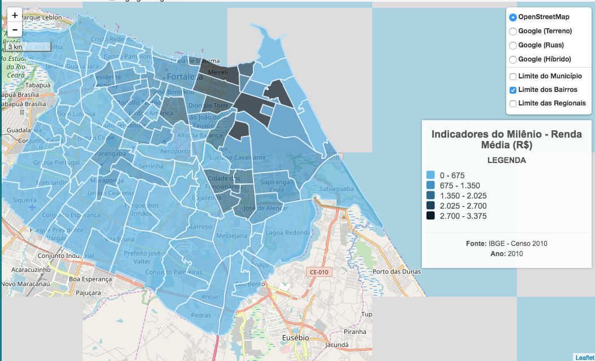

# Voucher Social CEJS

Esse projeto tem o objetivo de criar um indexador de desconto nas inscrições da [CEJS](http://www.cejs.com.br/) conforme a condição social com base na renda da área onde o participante more.

Em outras palavras, quanto mais baixa for a renda da área de sua moradia, maior o desconto na inscrição.

Para essa primeira versão utilizaremos [informações fornecidas pela prefeitura](http://mapas.fortaleza.ce.gov.br/) de Fortaleza com o [JSON fornecido](http://mapas.fortaleza.ce.gov.br/webapi/geojson/get/Fortaleza_em_Mapas:Renda_Media) que contém as informações de renda dos bairros.

No [site](http://mapas.fortaleza.ce.gov.br/) encontra em Social -> Indicadores do Milênio -> Renda Média

## Convite

Qualquer um pode contribuir com esse projeto, clamamos até que crie um versão se possível para sua cidade e quem sabe evoluímos a idéia a nível nacional.

Fork, altere e submeta PR por favor.

## License

MIT  
See [LICENSE](LICENSE) file.
